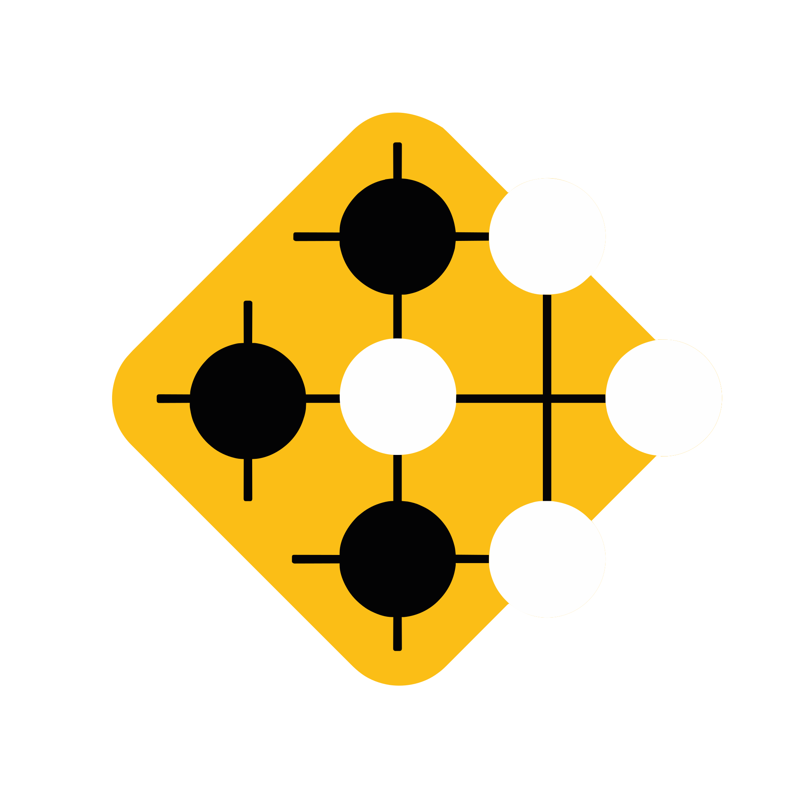

<table>
  <tr>
    <td width="150">
      
    </td>
    <td>
      <h1>TenukiGo-2025 - Plateforme d'Analyse et de Streaming de Go</h1>
    </td>
  </tr>
</table>

<p align="center">
    =15.5.9-black?style=flat-square&logo=next.js" alt="next.js" /> 
     
    =5.0.0-3178C6?style=flat-square&logo=typescript&logoColor=white" alt="typescript" /> 
    =4.0.0-06B6D4?style=flat-square&logo=tailwindcss&logoColor=white" alt="tailwindcss" />
     
     
     
    
     
     
     
     
    
     
    
</p>

**Tenuki** est une plateforme complète dédiée à la diffusion (streaming) et à l'analyse automatique de parties de jeu de Go. Elle utilise la vision par ordinateur (Computer Vision) et l'intelligence artificielle pour numériser des parties en temps réel ou depuis des vidéos/photos, générer des fichiers SGF et gérer une base de données de joueurs et de matchs.

Cette plateforme peut donc recevoir des flux vidéo en direct via le protocole RTMP depuis une caméra filmant un plateau de Go. Elle comprend aussi le travail d'analyse IA pour évaluer les positions de jeu et fournir des statistiques détaillées sur la partie.

## 🏗️ Architecture du Projet

Le projet repose sur une architecture micro-services orchestrée par Docker :

* **Frontend** (`frontend`) : Interface utilisateur moderne construite avec **Next.js 15**, **React 19** et **Tailwind CSS**.
* **Backend** (`backend`) : API principale en **Python (FastAPI)** gérant la logique métier, les utilisateurs et la base de données.
* **Database** (`db`) : Base de données **PostgreSQL**.
* **Analysis** (`analysis`) : Micro-service spécialisé dans l'analyse vidéo et le streaming (RTSP/RTMP). Utilise **OpenCV**, **YOLO** et la librairie **Sente**.
* **Photo** (`photo`) : Micro-service dédié à l'analyse de photos statiques et au scoring.
* **Streaming** (`mediamtx`) : Serveur de streaming en temps réel (basé sur **MediaMTX**) gérant les protocoles RTMP, RTSP et HLS.
* **GoInsight** (`goinsight`) : Micro-service fournissant des analyses approfondies sur tout le plateau ou bien sur une partie seulement du plateau, avec des statistiques avancées et des suggestions de coups. Il s'appuie sur le projet [GoInsight](https://github.com/leobeaumont/GoInsight).

---

## 🚀 Guide d'Installation et de Démarrage

Ce projet utilise **Docker** pour simplifier le déploiement de tous les services. Il est possible de lancer chaque service individuellement, mais Docker facilite grandement le processus, donc il est recommandé d'utiliser Docker pour un déploiement complet. 

### Prérequis
* Docker installé sur votre machine.
* Docker Desktop (ou Docker Engine) actif en tâche de fond.

### 1. Clonage du dépôt
Cloner le dépôt GitHub du projet :

```bash
git clone https://github.com/sadok-lajmi/TenukiGo-2025.git
cd TenukiGo-2025

```

### 2. Initialisation des variables d'environnement

Avant de construire les images Docker, deux fichiers `.env` doivent être créés :

* Dans le dossier `backend/`, créez un fichier `.env` avec les variables d'environnement suivantes :
```env
DB_URL="postgresql://go_user:secret@db:5432/go_db"
ANALYSIS_SERVICE_URL="http://localhost:5000"
ANALYSIS_CALLBACK_URL="http://localhost:8000/video/video_id/analysis-complete"
PHOTO_SERVICE_URL="http://localhost:5001"
MEDIAMTX_API_URL="http://localhost:9997"
MEDIAMTX_RTSP_URL="rtsp://localhost:8554"
MEDIAMTX_HLS_URL="http://localhost:8080"
WS_STREAMING_URL="ws://localhost:8000/ws/match"
```

* Dans le dossier `frontend/`, créez un fichier `.env` avec les variables d'environnement suivantes :
```env
NEXT_PUBLIC_API_URL="http://localhost:8000"
NEXT_PUBLIC_STORAGE_URL="http://localhost:8000/storage/"
NEXT_PUBLIC_WS_URL="ws://localhost:8000/ws/match/"
NEXT_PUBLIC_GOINSIGHT_SERVICE_URL="http://localhost:5002"
NEXT_PUBLIC_PASSWORD="<mot de passe pour l'interface web>"
```

### 3. Construction des images

Il faut commencer par se positionner dans le dossier `docker/` :

```bash
cd docker/

```

Assurez-vous que Docker est bien lancé. Une seule commande permet de construire toutes les images du projet :

```bash
docker-compose build

```

Si vous ne souhaitez construire que certains modules spécifiques (par exemple pour gagner du temps lors du développement d'une brique isolée), vous pouvez spécifier les services :

```bash
docker-compose build service1 service2

```

**Liste des services disponibles** (tels que définis dans `docker-compose.yaml`) :

* `db`
* `backend`
* `frontend`
* `analysis`
* `photo`
* `goinsight`
* `mediamtx`

### 4. Démarrage de l'application

Une fois les images construites, lancez l'application en mode détaché (en arrière-plan) :

```bash
docker-compose up -d

```

De même, pour ne lancer qu'une partie de la stack :

```bash
docker-compose up -d db backend frontend

```

### 5. Gestion et Logs

Vous pouvez utiliser **Docker Desktop** pour :

* Vérifier quels services tournent actuellement.
* Arrêter et relancer des conteneurs individuellement sans provoquer un "vrai" redémarrage complet.
* Consulter les logs de chaque conteneur via l'interface graphique.

Alternativement, pour consulter les logs en ligne de commande :

```bash
# Pour suivre les logs d'un service spécifique (ex: analysis)
docker-compose logs -f analysis

```

### 6. Arrêt et Réinitialisation

Pour arrêter proprement tous les conteneurs :

```bash
docker-compose down

```

Si vous souhaitez arrêter l'application **et** réinitialiser tous les volumes (ce qui effacera la base de données) :

```bash
docker-compose down -v

```

---

## Guide du Développeur

### 


---

## ⚙️ Configuration

Le projet nécessite des variables d'environnement pour fonctionner correctement (URLs des API, accès base de données, clés secrètes). Ces variables sont définies dans le guide d'installation.

Certaines variables d'environnement sont aussi présentes dans le fichier `docker/docker-compose.yaml` car elles utilisent des url internes à Docker pour communiquer entre services. Il est donc possible de lancer l'application via Docker ou bien en local en lançant chaque service individuellement.

---

## 📂 Structure du Projet

```
.
├── backend/            # API FastAPI principale
├── database/           # Scripts d'initialisation SQL
├── docker/             # Fichier Docker Compose et configurations
├── frontend/           # Application Next.js
├── modules/
│   ├── analysis/       # Traitement vidéo temps réel & différé
│   ├── photo/          # Complétion de coups entre photos
│   └── goinsight/      # Analyse avancée & statistiques
└── README.md

```
---

## Références des anciens projets 
* [GoGame Recognition Website (2023)](https://github.com/GoGame-Recognition-Project/GoGame-Recognition-Website)
* [TenukiGo (2024)](https://github.com/Borishkof/TenukiGo)

---

## Remerciements

### Structures

- [Tenuki](https://tenuki-brest.jeudego.org) Club de Go de Brest.
- [IMT Atlantique](https://www.imt-atlantique.fr) Grande École d'ingénieurs.

### Tuteurs et client
  
- Charlotte Langlais (Tutrice Ecole - IMT Atlantique)
- Etienne Peillard (Tuteur Entreprise & Client - Tenuki)

### Membres du projet

- Antonin Polette (antonin.polette@imt-atlantique.net)
- Saad Eddine Khazari (saad-eddine.khazari@imt-atlantique.net)
- Sadok Lajmi (sadok.lajmi@imt-atlantique.net)
- Samuel Vaton (samuel.vaton@imt-atlantique.net)
- Omar Amine (omar.amine@imt-atlantique.net)
- Nouhaila Baknine (nouhaila.baknine@imt-atlantique.net)
- Amira Balti (amira.balti@imt-atlantique.net)